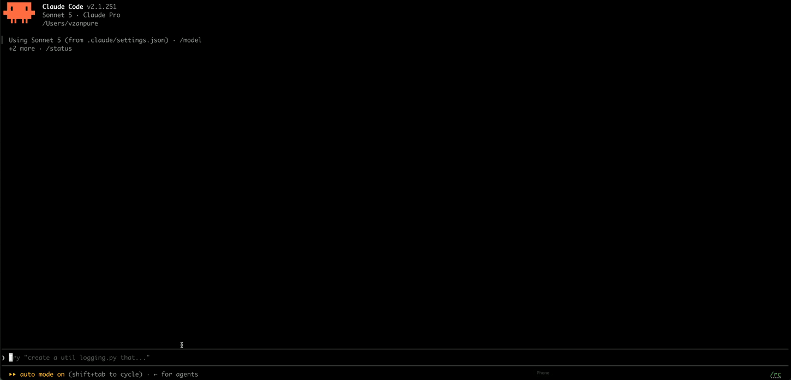

# highlight



Highlight parts of Claude's response, attach a comment to each, and submit them all as one precise follow-up — like a quick doc review on Claude's answers, instead of retyping or re-quoting things yourself.

## Usage

1. `/highlight:comment` — enters comment mode.
2. Select/highlight any part of Claude's last response with your mouse (Claude Code copies it to the clipboard automatically). Type your comment as a normal message — no command needed. You'll get an immediate confirmation of what was captured. Repeat for as many parts as you want.
3. `/highlight:submit` — Claude addresses every queued point directly, referencing each quote.

Run `/highlight:cancel` at any point to discard the queue without submitting.

## Requirements

- Local Claude Code sessions only (not over SSH — clipboard access doesn't cross the SSH boundary).
- macOS: works out of the box (`pbpaste`).
- Linux: requires `wl-clipboard`, `xclip`, or `xsel` to be installed.
- Windows/WSL: not yet supported.
- `jq` must be installed (used by the plugin's scripts).

## Install

```bash
claude plugin marketplace add vzanpure/highlight
claude plugin install highlight@vzanpure
```

For local development/testing instead:

```bash
claude --plugin-dir /path/to/highlight
```

## How it works

Claude Code already copies mouse-selected text to the system clipboard on its own. This plugin adds a `UserPromptSubmit` hook that, while comment mode is active, intercepts plain typed messages, pairs them with whatever's currently on the clipboard, and queues them — without spending a real conversational turn. `/highlight:submit` drains the queue and hands it to Claude as one structured follow-up.
